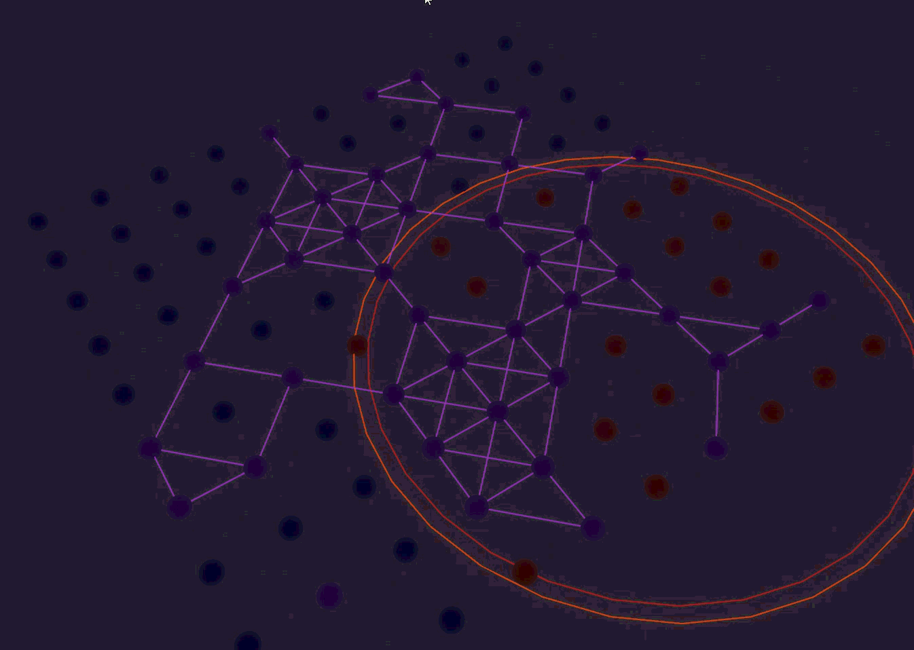

# QRES Research Portal & Validation Dashboard



This repository hosts the **Live Validation Dashboard** and **Research Gate** for the [QRES project](https://doi.org/10.5281/zenodo.18261441).

**QRES (Quantum-Resistant / Quorum-based Resource-Constrained Edge Swarm)** is a decentralized operating system designed for neural swarms in high-entropy edge environments. This web application serves as the visualization layer, allowing researchers to explore system behavior, benchmarking metrics, and vulnerability simulations in real-time.

> **Note:** This repository contains the *visualization frontend*. The core Rust system implementation is maintained in a separate repository.

## 🔬 Research & Visualization Tools

This portal provides interactive tools to validate the deterministic consensus and resilience of QRES:

*   **📊 Swarm Dashboard**: A React-based visualization of neural swarm internal states, showing node consensus and entropy levels.
*   **⚔️ Attack Lab**: An interactive simulation environment for testing robustness against Byzantine fault scenarios (Sybil, Eclipse, etc.).
*   **📈 Benchmark Charts**: Comparative performance metrics against standard Federated Averaging (FedAvg), highlighting QRES's 250x bandwidth efficiency.
*   **📚 Research Gallery**: Access to technical specifications, architecture diagrams, and academic publications.

## ⚡ Quick Start

This project is built with **Vite** + **React**.

### Prerequisites
*   Node.js (v18+)
*   npm or yarn

### Installation

```bash
# Clone the repository
git clone https://github.com/CavinKrenik/RESEARCH-QRES.git

# Navigate to the project directory
cd RESEARCH-QRES

# Install dependencies
npm install
```

### Development

Start the local development server:

```bash
npm run dev
```

### Build

Build the project for production:

```bash
npm run build
```

## 🛠️ Tech Stack

*   **Framework**: [React 19](https://react.dev/)
*   **Build Tool**: [Vite](https://vitejs.dev/)
*   **Styling**: [Tailwind CSS 4](https://tailwindcss.com/)
*   **Visualization**: [Recharts](https://recharts.org/)
*   **Icons**: [Lucide React](https://lucide.dev/)

## 🔗 Citation

If you use QRES or this dashboard in your research, please cite the following:

```bibtex
@software{Krenik_QRES_2026,
  author = {Krenik, Cavin},
  title = {{QRES: A Decentralized Operating System for Neural Swarms}},
  version = {v18.0.0},
  year = {2026},
  doi = {10.5281/zenodo.18261441},
  url = {https://doi.org/10.5281/zenodo.18261441},
  orcid = {0009-0008-9183-1278}
}
```

## 📄 License

This project is open-source and available under the **MIT** or **Apache-2.0** license.

